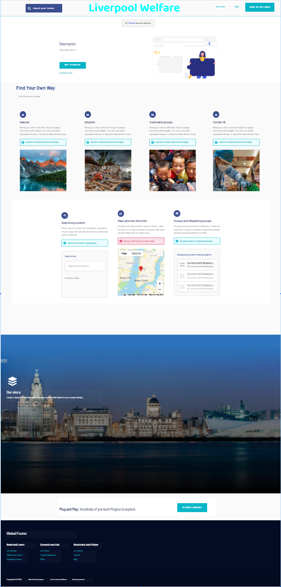

<!-- time: Fri. 10/02/2022  -->

# Group project
+ *Member*: Qi Wu, Zaichao Zheng, Ruoqian Zhang, Yujing Chen, Yuan Zhao, Junshu Sha

---
---

# Outline

1. Introduction(aim)
2. Aims & Objectives:
3. Key Literature & Background Reading
4. Development & Implementation Summary
5. Data Sources
6. Testing & Evaluation
7. Ethical Considerations
8. UI/UX Mockup
9. Project Plan including Risks & Contingency Plan:
10. Reference
---
---

# Intoroduction

Our project is to build up a local public welfare website. It is called “The Liverpool welfare” website and is an innovative intergration platform of public welfare in Liverpool. This website is mainly divided into 4 blocks and starts from environment protection, vulnerable groups, home rebuilding to COVID-19 volunteer recruitment. These blocks are used to help rasie funds for people and region that need necessary support. Additionally this website will also be a relatively comprehensive information platform of public welfare new and a local forum for public welfare. It uses database, AI to build a network ecoloy system to complete the interaction such as search, log, post donation information and comment between users. 
+ *Member*: Yujing Chen & Qi Wu 
**The project aims to build a regional public welfare website**

---
---

# Aims & Objectives:
> *Member*: Qi Wu, Zaichao Zheng, Ruoqian Zhang, Yujing Chen, Yuan Zhao, Junshu Sha
---
---

# Key Literature & Background Reading
> *Member*: Zaichao Zheng, Yujing Chen

The public welfare of UK began to evolve 1900s. The gorvernment and people started to consider that people who need help or regional donations. In rencent two years, COVID-19 pandemic has had considerable economic effect. 
+ poverty-stricken population:
    > Most people in the world live in poverty. According to Mushunje and Mafico (2010), the food poverty rate of population in some developed countries such as Zimbabwe and Kenya rose dramatically to a peak of 58%, with households headed by women and children registering higher rate. Moreover, there was 72% people cannot reach to the standard of the consume level in 2003 and this number kept falling in the following years (Mushunjeand and Mafico, 2010). 

+ orphans and vulnerable:
    > Sickness and poverty are the main problem of orphans and vulnerable children in the society. Sitienei and Pillay (2019) described that the proportion of poverty families who do not get enough financial support from the organization has reached to 45% in South Africa. Related to sickness, Chitiyo et al. (2016) informs that the increasing number of orphans as a result of HIV/AIDS pandemic in many African areas. Community-based organization can build the institutional care and use the cash transfer to decrease the poverty. Providing enough financial support to the families (Sitienei and Pillay, 2019). Furthermore, it can build the relationship between government and public welfare website to provide supporting funds the sicked children and orphans.   

+ unemployment rate
    > Most people have been badly hit in the COVID-19 especially in shops, restaurants and entertainment because there were unable fully open. The news from Jones, Palumbo and Brown (2021) shows that many of countries such as Italy, United States, United Kingdom and Germany in the world was struggled by rising unemployment rate. For example, the proportion of people who are without jobs hit a yearly total of 8.9% which is a singe of the end of the American job expansion in the decade. In the United Kingdom, the unemployment rate was 4.8% in March 2020 that means one in twenty people cannot find a job (King, 2021). 

---
+ environmental pollution:
    >Unep released its sixth global Environment Outlook today on the sidelines of the UN Environment Assembly.  According to the report, the earth's environmental pollution situation is critical and poses a growing risk to human health, with pollution affecting fertility and neurological development and causing millions of premature deaths in Asia, the Middle East and Africa by 2050 unless urgent action is taken.   

# Reference

Chitiyo, J., Chitiyo, A. and Chitiyo, M. (2016), “Psychosocial support for children orphaned by HIV/AIDS in Zimbabwe”, Childhood Education, Vol. 92 No. 6, pp. 465-9. (Accessed: 16 February 2022). 

 

Jones, L., Palumbo, D. and Brown, D. (2021) ‘Coronavirus: How the pandemic has changed the world economy’. BBC News. [Online] 16 February 2021. Available from: https://www.bbc.co.uk/news/business-51706225. (Accessed: 16 February 2022). 

 

King, B. (2021) ‘Unemployment rate: How many people are out of work?’. BBC News. [Online] 16 February 2021. Available from: https://www.bbc.co.uk/news/business-52660591. (Accessed: 16 February 2022). 

 

Mushunje, M. T. and Mafico, M. (2010) ‘Social Protection for Orphans and Vulnerable Children in Zimbabwe: The Case for Cash Transfers’, International Social Work, 53(2), pp. 261–276. Available at: https://search-ebscohost-com.liverpool.idm.oclc.org/login.aspx?direct=true&db=edshol&AN=edshol.hein.journals.intsocwk53.26&site=eds-live&scope=site (Accessed: 16 February 2022). 

 

Sitienei, C. E. and Pillay, J. (2019) ‘Psychosocial support for orphans and vulnerable children in a community-based organization in Kericho, Kenya’, Journal of Children’s Services, 14(4), pp. 292–302. doi: 10.1108/JCS-04-2018-0008. (Accessed: 16 February 2022). 

 

United Nations News(2019) Available at: https://news.un.org/zh/story/2019/03/1030211 (Accessed: 16 February 2022) 

 

---
---
# Development & Implementation Summary
> *Member*: Junshu Sha, Ruoqian Zhang

implementation language: 

+ front end: 
  1. HTML JavaScript  CSS
  2. freamwork: react   
+ Reason:  
HTML, CSS 和 JS 做为前段开发的基础语言必不可少

react框架是目前最火的也是最主流的框架之一有庞大的社区基础. 另外React 的组件特征也让功能的实现和debug更加便捷.
Componentized code is more modular, easier to reuse, and more maintainable. 

---

+ Back end: 
1. python >= 3.7
3. django >= 2.5  

+ Reason: 

Python虽然有慢的特点但是在小体量级别的网站上并不明显, 与此相比python带来的便捷和功能性要比java强的多.
Django 作为后端开发框架, 具有ORM的功能,这使得他可以直接修改数据库而不是手动插入, 同时Django的迁移功能相对于Flask框架也更便捷
Djangos Model layer comes with database ORM groups that make it easier to manipulate databases.  
whicih will directly generagte the database instead of write sql 
Djangos has its own management system admin,     so it is convenient to achieve a complete background data management control platform. 

+ development environment: 

	+ Database: mysql 

	+ IDE: pycharm and vs code 

	+ Tool: Anaconda 

	+ OS platform: Windows/MacOS 

  + search engine:
    + whoosh:
      + Whoosh is fast, but uses only pure Python, so it will run anywhere Python runs, without requiring a compiler.
      + By default, Whoosh uses the Okapi BM25F ranking function, but like most things the ranking function can be easily customized.
      + Whoosh creates fairly small indexes compared to many other search libraries.
      + All indexed text in Whoosh must be unicode.
      + Whoosh lets you store arbitrary Python objects with indexed documents.
  + HTML insert editor
      + DjangoUeditor3:
        + Ueditor HTML editor is baidu open source online HTML editor, very powerful functions, such as table can be directly dragged to adjust the size of cells, etc.
        + it can translate script to html
<!-- # Function 

**Mainly introduces the specific functions and affiliated components of the website**

+ Function web 
> Home page
> Environment Friendly
> Apartment donation
> Social contribution
> Contact us
> About us
> News
> Study platform
> ADs

+ Components
> Searching engine
> Database

---
--- -->

<!-- # Framework
The framework will be decided in Week4
+ Front end:
  + React
  + Vue
  + bootstrap

+ Back end: **We use python as back end and python version is default as 3.7 and later**
  + Django
  + Flask -->

---
---

# Data Sources
> *Member*: Zhao Yuan

Based on the basic positioning of the web users, the web functions and the information covered by the imagination and description, the following data is needed: Information about public welfare partners, Personal information of the donor, Browsing data and preferences of potential donors, progress and status of welfare projects, donation types, raising scale, sources and flow of donations. Meanwhile, collection of website crawlers, collection of official websites of potential cooperative organizations and some public data, collection of user personal information and behavior data are 3 main approaches to acquiring data involving project development. Moreover, there’re 3 possible risks for information security, which are information is hijacked and tampered, information is stolen and leaked and hackers disguise as customers. According to the three conditions, in order to ensure that information is obtained by unauthorized entity or process, we are prepared to take the following approaches, including the use of digital certificates for authentication only, use the TLS information encrypted to prevent information stolen in the process of information transmission between before and after end, using symmetric encryption to ensure the safety of general information transmission. At the same time, security confidentiality agreement will be set up and recommended to sign up by the users .
---
---

# Testing & Evaluation
> *Member*: Junshu Sha, Ruoqian Zhang

After the website has been designed, we will invite some volunteers to use our website. They will be invited to as users to look through our website, donate money, and join the disccussion on the local forum. After the experience, those volunteers will be invited to answer some questionnaires. These feedbacks from volunteers will be important evaluation to our product. 
我们将测试设置成一个测试金字塔, 由下到上是: 单元测试, 集成测试, 端到端测试.
+ 单元测试: 单元测试是指测试单个代码组件，而不是整块代码. 它验证所有组件逻辑的可操作性，以便在软件开发生命周期的早期阶段就发现缺陷，在进一步开发之前，对其进行修复.

单元测试也叫做“白盒”测试，因为需要完全掌握应用程序的结构和环境才能进行.

+ 集成测试: 单元测试往上一步就是集成测试，它把各个组件联合起来，作为一个组来进行测试. 集成测试用于识别各个组件之间交互时出现的问题，以检验代码是否符合功能说明书.

集成测试区别于单元测试的一个点是，它关注独立工作在整个组里面的模块和组件。而另外一边，单元测试关注于在测试前隔离模块或组件.

集成测试的关键是，在集成后的模块或组件之间，暴露任何软件缺陷或漏洞.

+ 端到端测试:

金字塔的顶部是端到端测试. 如名所示，端到端测试重复应用程序的所有操作，以测试应用程序的连接性和依赖性的方方面面. 这包括网络连接、数据访问和外部依赖.
端到端测试在模拟真实用户的环境下进行.

---
---
# Ethical Considerations
> *Member*: Qi Wu, Yujing Chen

---
---
# UI & UX Mockup
> *Member*: Junshu Sha, Ruoqian Zhang, Zaichao Zheng
Give a brief preview and early demo of each page

## UI

<!--  -->

You can find more details in following URL
https://github.com/ShaySha-PRa/COMP208/tree/main/UI

## Demo

---
---
# Project Plan including Risks & Contingency Plan:
> *Member*: Qi Wu, Zaichao Zheng, Ruoqian Zhang, Yujing Chen, Yuan Zhao, Junshu Sha

---
---

